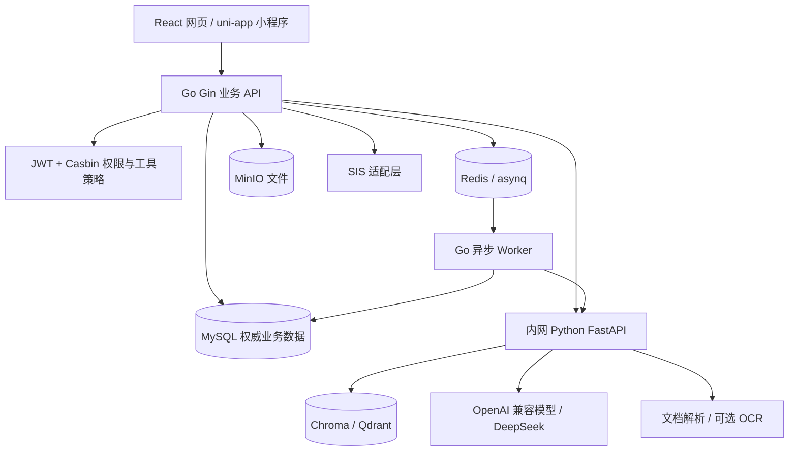

# desk 一体化中学辅助学习agent

desk 是面向中学学习场景的一体化辅助学习 Agent，连接知识资源、AI 伴学、练习反馈与动态学情，支持学生个性化学习、教师教学和家校协同。本仓库统一描述产品需求、技术需求、业务规则与验收标准；当前交付为需求文档，尚未实现应用程序。

| 项目 | 内容 |
| --- | --- |
| 文档版本 | 1.2，2026-09-05，详细功能要求已按阶段目标独立维护 |
| 产品名称 | desk |
| 产品定位 | 一体化中学辅助学习 Agent，以结构化知识资产和学生动态能力标签支持个性化学习与精准教学 |
| 核心能力 | AI 伴学、知识检索、个性化训练、错题归因、可控组卷、学情反馈与家校协同 |
| 交付形态 | 网页端 + uni-app 移动端小程序；支持 SaaS 与学校私有化部署 |
| 本期范围 | 高中语文、数学、英语的教—学—练—评—析—改闭环 |
| 文档来源 | 基于原“知微塾”产品方案整理：[原产品文档留档](docs/reference/original-product.md)，含 16 张本地化配图；已移除团队成员及人员分工 |
| 阶段目标 | [阶段范围、交付物与完成标准](docs/stage-goals.md) |
| 评审记录 | [需求追踪、冲突订正与验收评审](docs/requirements-review.md) |

原文明确的功能、技术选型、A1–A8 验收标准是本需求的约束。为使需求可开发、可测试，本 README 增补了状态机、数据模型、接口边界、计算口径与异常处理；这些属于**工程补充**，不冒充原文已有约定。标记为“建议基线”的数值与实现方案可在开发设计评审中调整，但不得降低原文验收标准。末节列出的外部配置待定项不代表已获业务确认。

## 目录

- [1. 产品目标与范围](#1-产品目标与范围)
- [2. 用户角色与权限](#2-用户角色与权限)
- [3. 产品流程与页面](#3-产品流程与页面)
- [4. 阶段目标](#4-阶段目标)
- [5. 关键业务规则与状态](#5-关键业务规则与状态)
- [6. 技术架构](#6-技术架构)
- [7. 数据与算法需求](#7-数据与算法需求)
- [8. API 与集成契约](#8-api-与集成契约)
- [9. 安全、性能与运维](#9-安全性能与运维)
- [10. 验收与交付阶段](#10-验收与交付阶段)
- [11. 待定配置与后续规划](#11-待定配置与后续规划)

## 1. 产品目标与范围

### 1.1 目标与成功标准

1. 提升教师效率：多维检索、模板与自然语言组卷、按班级弱项组卷，并允许单题替换和自定义修改。班级热力到补弱卷发布的演示路径不超过 3 分钟。
2. 支持学生精准学习：记录作答过程、错因与订正，形成可解释的动态学情标签，识别弱项后 24 小时内出现对应练习推荐。
3. 沉淀学校知识资产：连接公共资源、教师个人库和校本库，以审核、版本和权限保障复用质量；教学反馈持续回流。
4. 支持教学管理与家校协同：提供个人、班级、年级学习反馈、预警与阶段报告，让管理者和家长理解学习过程。

desk 通过 AI 伴学与个性化训练连接学习过程，以细粒度知识资产、题目与学生双向标签匹配、教师可控制的 AI 组卷支撑学习反馈闭环。原文竞品内容仅作为产品动机，不作为经过独立验证的市场事实或开发验收条件。

### 1.2 范围分层

| 范围 | 要求 |
| --- | --- |
| 本期必需 | 身份与组织、多维知识库、审核版本、知识图谱、AI 伴学与引用、动态学情、三类组卷、单题控制、任务考试、线上/拍照作答、初评与教师确认、错题本与平行训练、学情分析、家校任务与阶段报告、勋章积分、基础教研管理 |
| 原文 M3 能力 | 行为风险分、语义查重、SIS 成绩回流；按基础版本实现，外部 SIS 依赖适配配置 |
| 原文明确可选 | PaddleOCR；定时家长周报。OCR 实现可替换，但拍照上传、人工补录校正路径必须可用；周报可选不等于取消家校协同 |
| 演示替代 | OCR 可用 Mock 或少量样例；必须显式标明，不能将其结果作为真实生产能力验收 |
| 本期不支持 | 题目难度标签随学生表现自适应变化；高中语数英以外学段学科的完整业务链路 |
| 后续规划 | 难度标签自适应、学校教学风格与学习路径增强、多 Agent 协同、跨校/区域资源共享、生态运营 |

产品定位面向中学，本期先覆盖高中语文、数学、英语；初中及其他学科的完整链路另行规划。三科均应具备资源、任务、作答、批改确认、画像、补弱和报告路径。原文中的数学示例用于说明，不将产品缩减为数学演示。ToB 年费是商业模式背景，本期不据此新增在线支付、商城或收费结算系统。

## 2. 用户角色与权限

角色、租户、学年班级、任教学科、资源可见范围共同决定权限。以下权限约束由服务端落实，网页、小程序和 AI 工具统一执行。

| 角色 | 核心需求及可操作范围 | 禁止与边界 |
| --- | --- | --- |
| 教师 | 维护个人资源，访问授权校本资源；为任教班级组卷、发布任务、阅卷、确认成绩、查看学情与预警 | 不能查看未授权班级学生数据；题库审核需单独授权 |
| 学生 | 查看本人任务、作答、订正、错题、画像、训练、勋章与 AI 伴学 | 不能访问其他学生数据，不能调用监考、成绩写入或教师管理工具 |
| 家长 | 经学校确认绑定后查看本人孩子的任务、完成情况、阶段学习和考试报告 | 不含完整 AI 对话；不能直接修改成绩、作答或查看其他学生档案 |
| 教研组长/学校管理者 | 在授权年级、学科或校级范围查看质量分析、教师分配、班级/年级预警与资源建设情况 | 校级角色不自动获得教师私人草稿和全部学生对话权限 |
| 资源审核者 | 审核校本资源、题目及标签版本，退回并说明原因 | 只审核授权范围，操作可审计 |
| 平台运维角色（工程补充） | 租户配置、部署、系统健康、故障诊断 | 默认不拥有教学内容读取权限；授权维护需留痕 |

组织模型包含学校、学年、年级、班级、学科、用户和角色绑定。支持账号开通/停用、教师任课分配、学生班级归属、家长绑定/解绑；变更权限后应失效相关会话与缓存。教师离职时停用账号，已审核校本资产继续归学校保存，个人资源移交依据学校授权规则，不能自动公开私人内容。

## 3. 产品流程与页面

### 3.1 三个端到端场景

**期末复习与考后闭环：**教师选择高二数学、期末复习及函数/导数/数列等范围 → 结合历史表现与校本资源生成试卷 → 逐题调整并发布 → 学生线上考试或拍照提交 → 系统识别与初评、教师确认 → 生成班级共性问题及个人薄弱点 → 发布专项练习 → 训练结果更新画像 → 优秀试卷、典型错题、解析进入资源沉淀与审核流程。

**新教师备课与资源复用：**检索授权校本教案、试卷、典型题与教研资料 → 收藏到个人库并调整教学内容 → 关联知识点、整理个人方案与课堂练习 → 产生学生错题、优秀解法、课堂反馈 → 归档个人资源 → 申请共享并审核进入校本库 → 供后续教师复用。

**学生成长与家校协同：**采集日常作业、单元测试、期中期末考试和专项训练 → 更新知识掌握、错因、能力与趋势 → 教师补充阶段建议 → 家长查看任务进度、阶段报告与关注方向 → 沉淀长期学习档案。家长视图输出汇总与建议，不转发完整伴学对话。

### 3.2 页面与终端要求

| 端与页面 | 必须提供的信息和操作 |
| --- | --- |
| 教师工作台 | 待审核/待批改任务、班级任务进度、最近资源、学情预警入口 |
| 教师个人知识库 | 收藏题、典型错题、历史试卷、教学解析、教案资料；检索筛选、上传、编辑、标签、使用、共享审核进度 |
| 校本知识库 | 优秀试卷、典型错题、教学设计、优秀解析、教学课件、热门资源；筛选、预览、收藏、复用、资产与贡献统计 |
| 智能组卷 | 自然语言、模板、学情三种入口；参数约束、试卷结构、题目标签/答案解析、推荐理由、单题替换/修改、保存、预览、发布与导出 |
| 作业与考试/阅卷 | 任务范围、时间、试卷版本、完成进度、初评结果、教师复核、成绩确认与回流状态 |
| 教师学情分析 | 班级知识点热力、雷达图、高频错因、学生列表与预警；下钻个人证据、生成补弱卷、记录教学调整 |
| 学生首页/我的学习 | 今日任务、进度、近期记录、学习时长、训练推荐与标签摘要 |
| 学生作答/平行训练 | 题目与媒体、过程输入、拍照上传、草稿保存、提交、反馈、同知识点针对性训练 |
| 错题本/学习画像 | 错题分布、归因、自主反馈、订正历史、知识掌握、分数趋势、能力雷达、薄弱点与证据 |
| AI 伴学 | 会话、分步引导、有效引用、关联练习；考试上下文下控制答案披露 |
| 勋章与积分 | 个人勋章墙、积分记录与授权范围积分榜；规则和统计周期可查看 |
| 学校/教研管理 | 年级与班级对比、学科分析、教师分配、年级预警、资源建设统计、汇报导出 |
| 家长端 | 已绑定孩子切换、任务与完成情况、阶段学习/考试报告、教师建议；可选周报 |

网页端优先覆盖师生主流程，管理和家长页面可精简。小程序至少覆盖任务查看、线上/拍照提交、错题与训练、AI 伴学、画像和家长报告；教师移动端提供任务进度与学情查看。复杂组卷与资源编辑可由网页承担，此终端分工为工程补充，不能删减总体功能。

所有列表提供分页、筛选、空态、加载和错误反馈；上传、解析、批改、组卷和导出显示处理中/失败/重试。数学公式、中文材料、英语文章与题组应正确呈现；提交与发布给出清晰结果，弱网下保留已保存草稿。页面原型是信息与流程参考，示例姓名、分数、资源数量和装饰性布局不构成真实业务数据或固定指标。

## 4. 阶段目标

详细功能范围、阶段依赖、交付物及完成标准见 [阶段目标文档](docs/stage-goals.md)。

| 阶段 | 目标 |
| --- | --- |
| M0 | 建立身份、知识底座与带引用的 AI 伴学 |
| M1 | 形成动态学情、错题订正与个性化训练闭环 |
| M2 | 打通教师组卷、任务考试与教学反馈 |
| M3 | 补齐家校协同、学习激励和外部系统集成 |
| M4 | 完成三科全链路、移动端及部署验收 |

## 5. 关键业务规则与状态

以下为工程补充，约束所有界面、API 和后台任务。

| 对象 | 状态及合法流转 | 强制规则 |
| --- | --- | --- |
| 文件导入 | 上传中 → 已上传 → 解析中 → 待校正/待审核；失败可重试 | 解析失败不产生可正式使用的题目 |
| 资源版本 | 草稿 → 待审核 → 已审核；待审核 → 已退回 → 草稿；已审核 → 已下架/归档 | 实质修改派生新草稿；只允许已审核有效版本进入正式组卷和新发布 |
| 试卷 | 草稿 → 校验通过 → 已发布 → 归档/作废 | 发布锁定题目、答案、分值和顺序快照；修改已发布内容须新版本与显式重发布 |
| 任务 | 草稿 → 已发布（含未开始）→ 进行中 → 已截止 → 已完成/归档；可撤回/作废 | 只有时间窗口、参与权限及任务状态均满足才接受提交；已完成要求应处理答卷已处理 |
| 答卷 | 作答中 → 已提交 → 待批改 → 待确认 → 已确认 | 订正另存；更正成绩保留旧版本，不倒写原作答 |
| AI/导出任务 | 排队 → 运行 → 成功/失败/取消 | 超时和重试可见，不将局部结果当作完整成功 |
| 成绩回流 | 待处理 → 处理中 → 成功/失败 → 重试 | 成绩版本 + 消费者幂等；内部画像与外部 SIS 分别显示状态 |
| 学情预警 | 待处理 → 已干预 → 待复查 → 已解除 | 保存触发证据及处理历史，不自动删除未解决的问题 |

资源删除采用逻辑删除与权限撤销，已发布考试保留必要快照和审计记录；依法删除学生数据时采用单独生命周期流程处理关联对象、缓存、向量与备份保留策略。题库资源失效后，历史查看仍需身份与用途鉴权。

## 6. 技术架构

### 6.1 选型基线

| 层 | 原文选型 | 技术要求 |
| --- | --- | --- |
| 网页 | TypeScript + React | 共享领域类型；师生主流程优先，家长/管理可精简 |
| 移动 | uni-app 小程序 | 与网页使用同一 Go API、权限和业务状态 |
| 业务后端 | Go + Gin + GORM | 对外唯一 BFF/API，负责身份、业务规则、事务、审核及 AI 编排 |
| 鉴权 | JWT + Casbin | 角色、班级、资源和工具 ACL；每次服务端校验 |
| 主库 | MySQL/InnoDB | 权威业务数据与事务；JSON 仅用于可扩展字段 |
| 缓存/队列 | Redis + asynq | 会话、热力缓存、异步解析/批改/画像更新等任务 |
| 文件 | MinIO | 原文件、课件、试卷、拍照与导出；预签名上传和受控下载 |
| AI 服务 | Python + FastAPI | 内网 HTTP，由 Go 调用，承接解析、检索、模型推理及建议输出 |
| 向量检索 | Chroma（演示）→ Qdrant（放量） | 与 MySQL 解耦，通过适配接口切换，索引可重建 |
| 文档解析 | PyMuPDF / unstructured | 只在 AI 服务中执行，按文件类型路由 |
| LLM | OpenAI 兼容接口，DeepSeek | 只经 AI 服务访问；供应商、模型和密钥走配置 |
| OCR | PaddleOCR（可选） | 保留人工校正/补录与演示替代标识 |



前端不能直连数据库、向量库或 AI 服务；对象存储上传可通过 Go 签发的短期 URL 直传，完成回调仍由 Go 校验。AI 服务不持有业务写权限，返回结构化建议；由 Go 执行验证和授权后的业务写入。Redis/asynq 由 Go Worker 消费，再调用 Python HTTP，避免假设 Python 原生消费 asynq 协议。

### 6.2 模块与一致性

后端按身份组织、资源审核、题库图谱、组卷任务、作答阅卷、学情推荐、报告激励、集成审计划分模块；初期采用模块化单体 + 独立 AI 服务即可，不要求微服务拆分。

MySQL 是资源版本、审核、答卷、成绩及画像证据的事实来源。向量库、缓存与报表是派生数据。审核/下架事件驱动索引更新，检索命中返回前再次校验主库权限和版本状态，不能依赖异步索引承担安全闸门。

成绩确认采用事务写成绩版本及 outbox 事件；异步消费者按版本幂等更新掌握度、报表和 SIS。界面区分“成绩已确认”与“画像/外部同步处理中”。失败进入可重试队列与人工排查入口，定期对账补偿，不丢弃业务事件。

## 7. 数据与算法需求

### 7.1 核心实体

| 领域 | 实体及关键数据 |
| --- | --- |
| 身份组织 | tenant、user、role_binding、class、enrollment、teaching_assignment、guardian_binding；有效时间、授权范围 |
| 资源 | resource、resource_version、file_object、import_job、review、favorite；拥有者、可见范围、来源、派生版本、审核人/时间 |
| 题库 | question、question_version、question_tag、rubric；题型、题干、材料、子题、答案、解析、分值、难度/能力/错误标签 |
| 图谱 | knowledge_node、knowledge_edge、question_knowledge、ability；学科、关系类型、来源、版本 |
| 试卷任务 | paper、paper_version、paper_item、template、assignment、assignment_recipient；约束、题目快照、分数、时间、披露策略 |
| 作答阅卷 | attempt、answer、answer_revision、grading_suggestion、grade_version；过程/原图、初评、教师终评、确认时间 |
| 认知与训练 | evidence、memory_summary、mastery_state、student_tag、wrong_question、feedback、recommendation；证据链接、算法版本、时间窗、置信及原因 |
| 教学与家校 | alert、intervention、report_snapshot、teacher_feedback；范围、触发原因、阶段统计、家长可见字段 |
| 激励与风险 | badge、point_ledger、risk_signal、similarity_result；规则版本、来源事件、处置 |
| 集成运维 | outbox_event、job、sis_mapping、sync_record、audit_log；幂等键、重试、错误、trace_id |

租户业务表具有 tenant_id；跨实体引用必须同时验证租户一致性。学生数据关联学生/班级范围，个人资源关联拥有者，校本资源关联学校。成绩版本、试卷版本与学习证据建立明确外键关系。

建议唯一约束包括 `(tenant_id, assignment_id, student_id, attempt_no)`、`(tenant_id, event_id, consumer)`、`(tenant_id, source_event_id, point_rule_id)`；常用检索按租户、学科、知识点、状态、时间建立索引。时间服务端统一保存 UTC，客户端按学校时区展示；分值使用定点数，禁止浮点累计误差。

### 7.2 三层记忆与解释链

原文要求“三层记忆”和可展开的 L2/L1 证据，但未定义层级；本期采用以下工程解释并保留替换空间：

- **L1 原始证据：**有效作答、过程、订正、自主反馈、教师评价与伴学片段，带时间、来源和访问权限。
- **L2 学习事件摘要：**将 L1 聚合成知识点表现、错误模式和训练变化，保留 L1 引用及生成版本。
- **L3 长期画像：**知识掌握、能力短板、稳定错误模式与趋势，关联支撑它的 L2/L1。

界面从画像或知识节点逐级展开到摘要、具体答题或反馈。证据不足显示未知/待验证，不能把模型推断显示为确定事实。证据更正或删除后重算关联画像，不保留无证据支撑的主张；家长的解释视图使用允许披露的汇总证据，不开放完整聊天。

### 7.3 BKT 最小掌握度

采用可解释的知识点级 BKT（贝叶斯知识追踪）作为原文要求的最小模型。记录先验掌握概率 `p`、猜测率 `g`、失误率 `s`、学习转移率 `t` 及模型版本。

```text
答对后的后验 = p*(1-s) / [p*(1-s) + (1-p)*g]
答错后的后验 = p*s / [p*s + (1-p)*(1-g)]
更新掌握概率 = 后验 + (1-后验)*t
```

参数限定合法概率范围，分母异常时拒绝更新并记录错误。冷启动使用可配置先验并标记低证据量；参数数值需用学科样本校准，原文没有提供统一默认值。

最小版本只使用已确定判分的独立练习及教师确认的考试证据。自述反馈/AI 初评进入错因候选与记忆，不直接变成确认考试成绩。多知识点题优先按评分点映射证据，无法拆分时记录主知识点与覆盖关系，避免将一道题当作多个独立成功样本。部分得分到二元观测的阈值须配置并保留转换记录。更正按时间顺序回放有效证据，不简单叠加一次反向更新。

能力标签另根据题目能力要求、错因和多次表现解释生成，不将知识点 BKT 概率直接冒充全部学科能力分。

### 7.4 匹配与质量控制

检索先执行租户/资源权限、审核状态、学科与有效版本等硬过滤，再组合知识点覆盖、能力差距、难度、计算强度、灵活度、教学场景和近期曝光进行排序。排序权重属于可配置工程策略；记录输入画像版本、候选题版本、命中理由与策略版本以便复现。

自然语言解析与 AI 批改输出均使用结构化 schema 校验；缺字段、非法标签、越权工具、无效引用、题目答案不完整时不得进入正式业务写入。模型超时可重试，教师手工检索、编辑、批改路径保持可用。

## 8. API 与集成契约

以下为待实现的接口需求，不表示仓库已提供可运行服务。所有业务 API 使用 `/api/v1` 前缀；最终 OpenAPI 应覆盖权限、字段、示例、状态码及幂等行为。

| 领域 | 接口示例 | 关键规则 |
| --- | --- | --- |
| 身份组织 | `POST /auth/login`、`POST /auth/refresh`、`POST /auth/logout`、`GET /me`、`/classes`、`/teaching-assignments`、`/guardian-bindings` | 服务端确定租户和角色，不信任客户端自报身份 |
| 资源导入 | `POST /uploads/presign`、`POST /imports`、`GET /jobs/{id}`、`GET /resources` | 绑定对象键、格式/大小限制、导入状态与错误 |
| 审核版本 | `POST /resources/{id}/versions`、`POST /resource-versions/{id}/submit-review`、`POST /resource-versions/{id}/review` | 使用版本号/If-Match 乐观锁，审核意见与授权验证 |
| 题库图谱 | `GET /questions`、`GET /knowledge-nodes`、`GET /knowledge-nodes/{id}/relations` | 过滤权限、状态、学科、知识点等；答案字段按角色与任务披露 |
| 组卷 | `POST /paper-generations`、`PATCH /papers/{id}`、`POST /papers/{id}/items/{itemId}/replace`、`POST /papers/{id}/publish`、`POST /papers/{id}/exports` | 长任务返回 202 + job_id；发布重新验证全部题目版本及约束 |
| 作答 | `GET /assignments`、`POST /assignments/{id}/attempts`、`PUT /attempts/{id}/answers/{itemId}`、`POST /attempts/{id}/submit` | 草稿版本冲突返回 409；提交幂等、时限和参与权限校验 |
| 批改 | `GET /grading-tasks`、`PATCH /grades/{id}/draft`、`POST /grades/{id}/confirm`、`POST /grades/{id}/corrections` | 仅授权教师；写入成绩版本和可靠回流事件 |
| 学情训练 | `GET /students/{id}/profile`、`GET /classes/{id}/analytics`、`GET /evidence/{id}`、`GET /wrong-questions`、`POST /feedback`、`GET /recommendations` | 各级下钻、证据、推荐均校验数据范围 |
| AI 伴学 | `POST /tutoring/sessions`、`POST /tutoring/sessions/{id}/messages` | 绑定任务模式；流式输出可取消，引用和工具授权不可绕过 |
| 家校管理 | `GET /reports`、`GET /alerts`、`POST /alerts/{id}/interventions`、`GET /badges`、`GET /points`、`GET /leaderboards` | 按家长绑定和角色裁剪字段；榜单不外泄学习档案 |
| 风险/SIS | `GET /risk-signals`、`POST /risk-signals/{id}/reviews`、`GET /sis/sync-records`、`POST /sis/sync-records/{id}/retry` | 专项权限，审计与重试幂等 |

统一响应包含业务数据或错误 `code/message/details/trace_id`；列表包含分页游标/页码与数量。HTTP 401 表示认证失败，403 为权限拒绝，404 用于不存在或需隐藏的资源，409 为版本/状态冲突，422 为业务校验失败，429 为限流，5xx 为服务失败。错误不得包含密钥或完整学生数据。

创建提交、发布、确认成绩、积分发放和同步请求采用幂等键；同键同请求返回原结果，同键不同载荷返回冲突。上传完成验证对象存在、大小、类型和归属，预签名 URL 有效期建议不超过 15 分钟。

Go → Python 使用内网服务凭据、trace_id、超时和调用限额；传递最小必要上下文及已授权候选范围。SIS 使用独立凭据与学校映射，不把外部系统错误包装为内部成绩确认失败。

## 9. 安全、性能与运维

### 9.1 安全与隐私

- 全链路 HTTPS；JWT 短期有效并支持刷新、退出/停用撤销，密码安全哈希，登录和 AI 调用限流。Casbin 校验角色/班级/工具 ACL，租户过滤同时落实于数据库查询、向量检索、缓存键、对象路径与导出。
- 上传做 MIME/扩展名/大小校验，解析任务隔离并限制资源；下载不暴露永久公共地址。学校资料与学生信息只按授权用途访问。
- 学生身份、家长绑定、学习过程和对话按最小必要原则采集；第三方模型输入去除非必要姓名/联系方式。私有化部署是否允许调用外部模型必须可配置，不能把私有部署误解为天然离线。
- 教师审核、资源共享、成绩确认/更正、角色变更、敏感导出、AI 工具调用、SIS 同步保留审计。运行日志脱敏，不记录访问令牌、密钥或完整对话内容。
- 数据保留、导出、删除和备份过期策略由学校及合规要求配置；生产上线前落实未成年人数据授权和报告可见范围。密钥通过环境配置或密钥管理系统注入，不提交到 Git。

### 9.2 非功能建议基线

原文仅给出 A1–A8 的硬指标。以下为新增的初始测试目标，需在实际部署硬件和数据规模下确认；不得作为已经完成的压测报告。

| 项目 | 建议目标与测量边界 |
| --- | --- |
| 基础页面 | 100 并发用户、10 万道题的试点数据下，普通 API P95 ≤ 1 秒，组合检索 P95 ≤ 2 秒；不含上传和模型计算 |
| 长任务交互 | 组卷、解析、批改、导出在 2 秒内返回任务受理状态；进度可查询，AI 等待计入 A3 端到端时间 |
| 可用性 | 月度业务服务可用性 ≥ 99.5%；记录停机定义与维护窗口，不以隐藏故障达标 |
| 一致性 | 无重复提交、重复计分、重复画像证据；成绩回流建议 60 秒内可见，失败可追踪补偿 |
| 恢复 | 建议 RPO ≤ 24 小时、RTO ≤ 4 小时；数据库、对象文件、配置和密钥恢复分别演练 |
| 兼容与可用性 | 网页覆盖现代 Chrome/Edge/Safari 与窄屏；小程序按目标平台真机验证上传、公式、长题、弱网和恢复 |
| AI 质量 | A1 引用、无泄题、初评可复核、资源审核闸门同时达标；模型替换后回归固定样本集 |

### 9.3 部署与可观测性

同一业务代码通过配置支持 SaaS 多租户和单校私有化部署。交付应包括服务镜像或构建说明、环境变量模板、数据库迁移、初始化角色/字典、样例数据、健康检查、备份恢复与升级回滚手册。建议提供 Docker Compose 作为演示部署方案，不将 Kubernetes 列为本期硬依赖。

依赖配置包含 MySQL、Redis、MinIO、向量库、Python AI 地址、模型 endpoint/key、JWT/服务密钥、学校时区与功能开关。演示数据使用虚构身份，Mock OCR/外部 SIS 标识清晰。真实生产部署不得默认启用演示账号和 Mock。

监控 API 延迟/错误率、模型超时及用量、队列积压、解析失败率、待审核量、成绩同步失败、索引延迟、推荐超时与 A2/A3 路径。日志贯通 trace_id，业务故障告警包含可定位对象但避免敏感正文。向量与缓存可重建，数据库和对象文件必须纳入备份；发布前执行迁移校验和恢复演练。

## 10. 验收与交付阶段

### 10.1 原文 A1–A8 硬验收

| 编号 | 原文标准 | 可执行验证与通过证据 |
| --- | --- | --- |
| A1 接地解题 | ≥80% 终答步骤含有效引用，且可点击回原文 | 在约定三科学习答疑集逐步标注终答推理步骤；有效引用步骤数/全部终答步骤数 ≥80%。引用必须存在、可访问、定位正确且实质支撑步骤；伪造/不相关/无权访问均无效。考试禁答用例另验，不混入分母美化指标 |
| A2 个性化闭环 | 辅导识别弱项概念，24h 内可出现对应练习推荐 | 记录弱项识别与对应已审核练习对该学生可见的服务器时间；差值 ≤24h，且匹配知识点与理由可查 |
| A3 教师效率 | 从打开班级热力到发布补弱卷 ≤3 分钟（演示脚本） | 按固定班级、已审核题库和模板计时，包含模型等待、参数查看及发布；录屏/事件时间差 ≤180 秒，不能预生成最终试卷替代流程 |
| A4 题库闸门 | 未审核题目不可进入正式组卷 | 草稿、退回、待审核、已下架及修改后新版本均尝试经 UI/API/AI 进入正式卷，全部被拒；已审核有效版可用 |
| A5 掌握度解释 | 画像/节点主张可展开到 L2/L1 证据 | 从个人画像和知识节点分别下钻到摘要、原作答/反馈，证据链正确且权限有效；无证据显示不足 |
| A6 考试回流 | 教师确认成绩后，成绩册与掌握度均更新成功 | 确认前不产生正式成绩回流，确认后两处最终一致；重复投递不重复更新，更正后重算成功；失败状态与重试可追踪 |
| A7 权限隔离 | 学生无法调用监考/成绩写入类工具；跨班数据不可见 | 直接 API、修改 ID、AI 工具调用、检索引用、导出、对象链接和缓存分别验证拒绝；同时验证授权教师/管理者正常路径 |
| A8 部署 | 部署后可完成上述演示路径 | 在干净环境按交付手册部署，初始化虚构学校与三科样本，执行 A1–A7 并保存结果；Mock 不能代替所宣称的真实能力 |

引用评测集建议每科至少 10 道、涵盖多步讲解与来源不足；这是新增样本建议，不改变原文 80% 阈值。除总体指标外单列各科结果，避免单科缺陷被平均值掩盖。

### 10.2 阶段验收与发布门槛

各阶段的功能交付物、完成标准及 T01–T07 补充用例统一维护在 [阶段目标文档](docs/stage-goals.md)。本期正式发布须覆盖全部非可选功能、高中三科全链路、移动端主路径和两种部署配置，并通过 A1–A8/T01–T07。

周期为原文建议，具体阶段可按工作量调整；未完成的必需功能应明确补齐计划，不自动从本期范围删除。当前仅完成需求文档整理与评审，实际功能验收将在开发后执行。

## 11. 待定配置与后续规划

以下是原文未给出的外部信息或数值，已定义配置入口和安全默认行为，可据此推进开发；生产接入前需要学校/接口资料确定。

| 待定项 | 开发处理与边界 |
| --- | --- |
| 高中三科教材版本、知识点字典与标签评分细则 | 使用可配置字典和虚构样例，不把示例导数章节当成完整知识体系；完整业务验收补齐三科数据 |
| 小程序具体平台、账号接入方式与学校身份源 | 保持 uni-app；默认学校账号 + 经确认家长绑定，真实平台发布资质与 SSO 另配 |
| 题库采集来源与授权、校本/个人资源移交规则 | 采集白名单和来源元数据；默认不自动公开个人资源，不预置未知网站爬取 |
| BKT 参数、掌握阈值、预警阈值、推荐权重与积分规则 | 版本化配置、证据可解释；生产启用前按学科样本校准 |
| SIS 协议、身份编码与沙箱 | 实现适配接口及契约测试；无真实接口时标明模拟同步，不声称完成真实系统验收 |
| 模型与部署容量、数据保留及外发策略 | 按配置落地；非功能建议指标经目标环境验证，私有部署显式控制外部调用 |
| “三层记忆”原始术语精确定义 | 采用第 7.2 节工程定义；保持 A5 的 L2/L1 可追溯要求 |

中期建设校本资源持续优化、题目难度标签自适应、更完善学生能力模型与个性化学习路径，增强教学风格和年级/班级趋势分析；长期发展 AI 教学 Agent 协同、跨校/区域资源共享、教学管理与数据决策支持及生态运营。上述规划保留原文方向，不作为本期已经实现或必须交付的功能。
