1. # 产品定位

   知微塾是一套面向学校的知识资产驱动型精准教学平台，通过构建**结构化知识库与学生能力标签**体系，连接**教学资源、学习数据和AI能力**，实现从资源沉淀到精准教学的闭环。

   > **产品核心内容：** 智慧教育平台  
   > **交付形态：** 网页端+移动端

## 产品目标

- **提升教师教学效率：**通过知识库和AI能力，实现试题精准匹配、“智能+个性化”组卷。

- **实现学生精准学习：**基于学生答题数据，构建学生个人学情标签，完成错题归因、薄弱知识点识别，基于**知识图谱关联题目**标签进行针对性训练。

- **建立教学数据闭环：**沉淀教师教学资源和学生学习数据，形成可持续优化的教育知识库。

1. # 市场痛点与需求分析

   1. ##  用户定位

      |**核心用户**|**使用场景**|**痛点问题**|
      |---|---|---|
      |  一线教师|场景A：日常组卷/出题|网上题库质量参差不齐，无法针对性、个性化组卷|
      ||场景B：作业批改与复盘|重复性批改，难以统计错因|
      ||场景C：个人经验沉淀 想把今年出的好题、学生常错的题存下来，次年复用|个人积累的优秀教案和题库散乱，易丢失|
      |   学生|场景A：日常作业练习|反馈滞后|
      ||场景B：错题整理 需要抄题、剪报或重新买题集来巩固|错题整理耗时|
      ||场景C：考前自主复习 想针对薄弱环节刷题，但不知道哪些属于自己的常考易错点|复习盲目 效率低 针对性弱|
      |   学校管理者 教研组长|场景A：教学质量监控 期中/期末后需要了解各年级、各学科的教学质量差异。|数据黑盒：只有模糊的分数排名，缺乏细粒度的知识点掌握数据。|
      ||场景B：学校资源库建设|骨干教师离职带走核心资源，新教师无法复用，学校知识资产无法累积。|
      ||场景C：迎检与汇报 拿出数字化成果应对上级检查。|缺乏细粒度的数据支持|
      |家长|场景A：课后辅导|辅导无力|
      ||场景B：学情追踪|信息断层：只能通过考试分数判断好坏，对孩子日常的学习过程（如错题分布、知识点盲区）不够了解。|

   2. ## 竞品分析

      |**维度**|**作业帮/猿题库 (C端)**|**科大讯飞 (B端）**|**组卷网/试题网**|
      |---|---|---|---|
      |核心逻辑|流量逻辑：海量免费题 -&gt; 吸引学生 -&gt; 卖课|基础平台 -&gt; 覆盖全区 -&gt; 卖硬件+系统|试题库 -&gt;提供搜索 -&gt;导出试卷|
      |AI辅助|支持 - AI批改 - AI伴学：各学科提问 - AI辅导作文|支持 - AI拍照解题 - AI英文语伴 - AI辅导作文|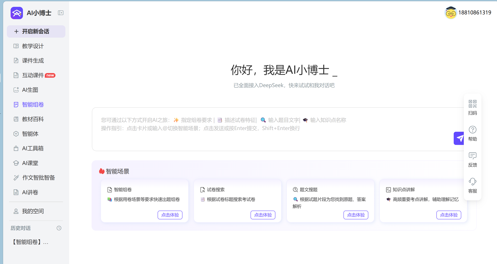 通过AI Agent一键组卷、知识点讲解，拍照搜题、作文批改、多种智能体|
      |个性化|千人千面 (算法推荐)|基于班级/校级数据|个性化弱，支持收藏题目|
      |资源归属|厂商私有|平台托管|用户自有（可导出）|

   3. ## 总结

      - **服务深度浅：**更关注宏观学情统计、C端产品脱节校内流程，难支撑一线精准教研。

      - **知识资产沉淀薄弱：**即使竞品支持私有化部署，学校能看到数据，但这些数据多为非结构化的分数、日志和散落的课件文件，复用率较低。

      - **教师组卷灵活性差：**目前产品组卷完成后，仅支持替换相似题目，不支持在原题目基础上自定义试题。

2. # 产品亮点

   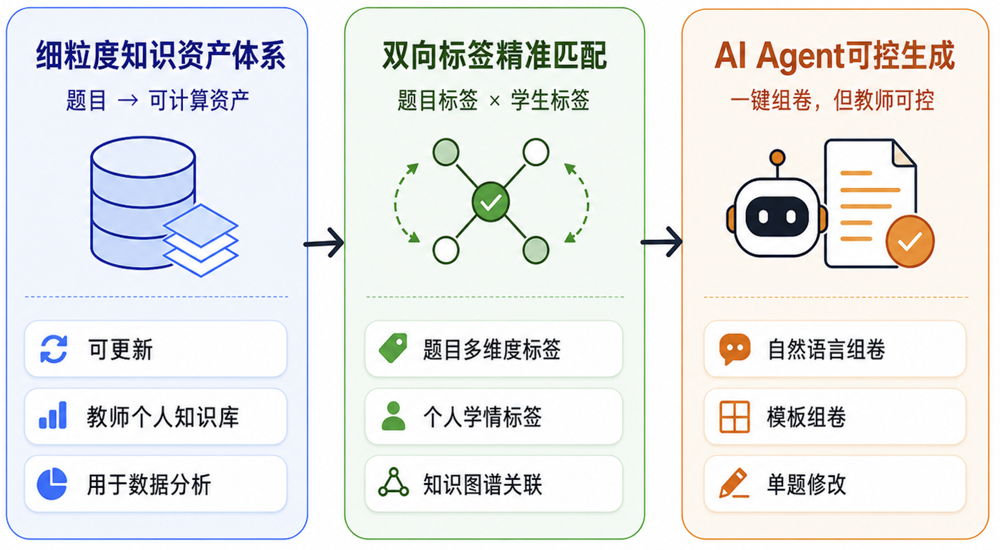

3. # 产品核心功能

   1. ## 产品功能架构

      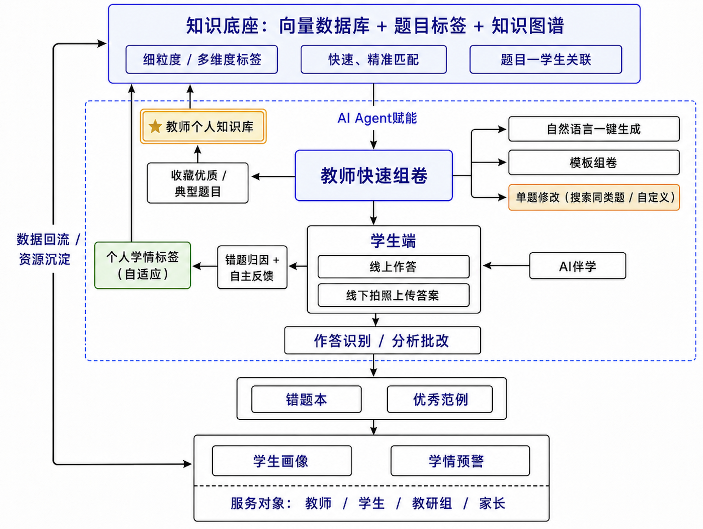

   2. ## 核心功能页面

      1. ### 知微塾 教师端

         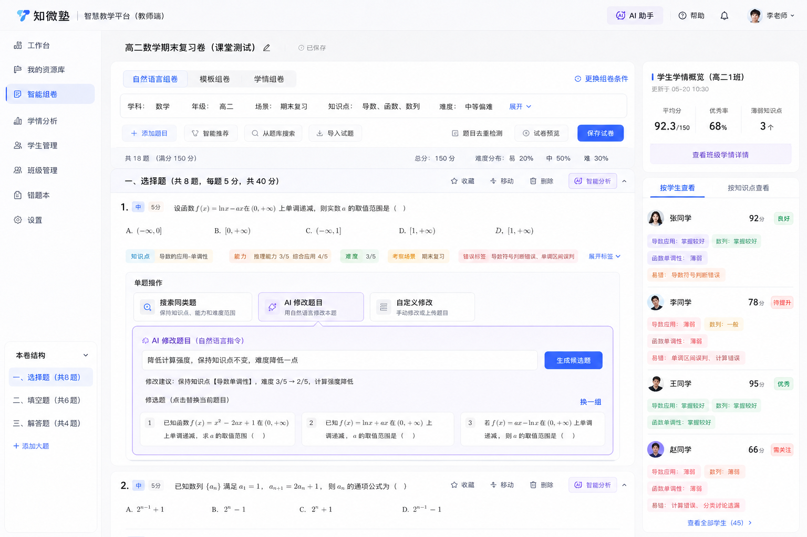

      2. ### 知微塾 学生端

         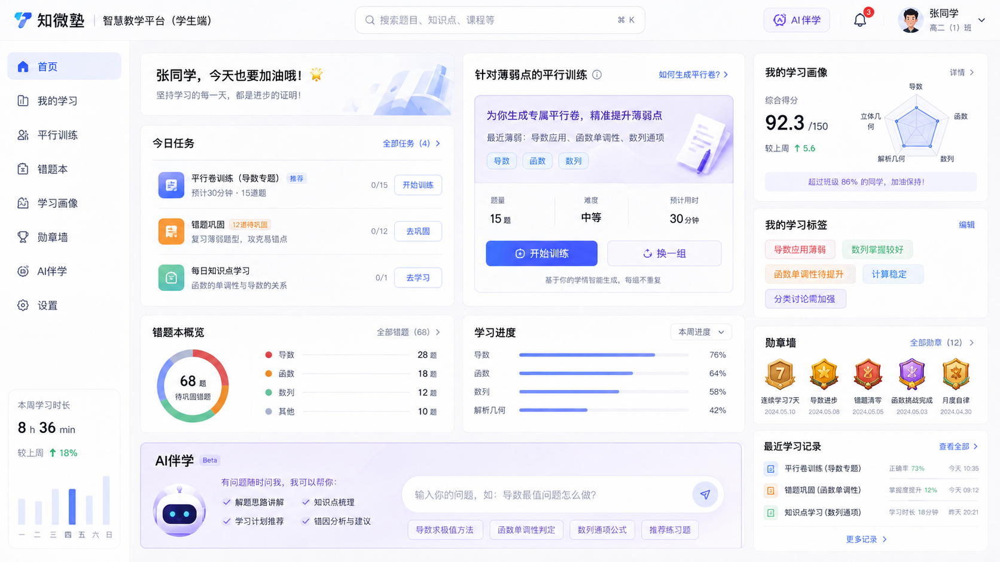

      3. ### 教师个人知识库

         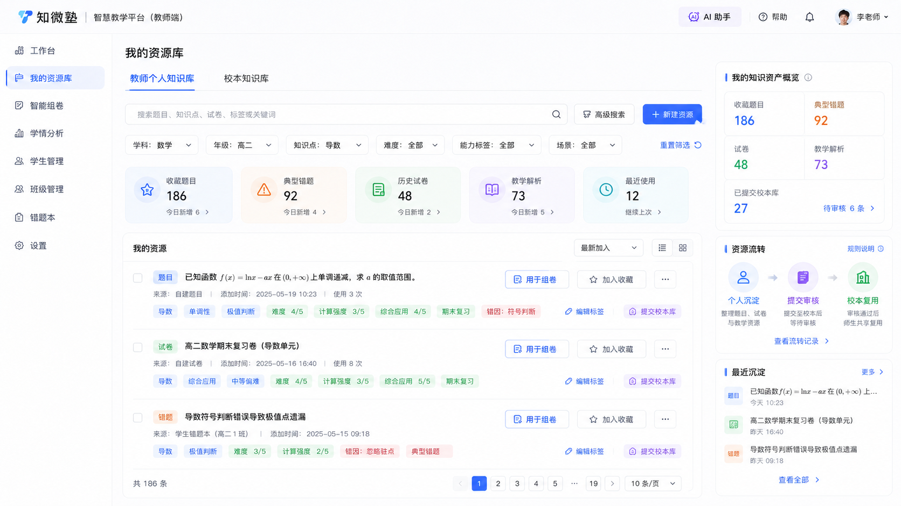

      4. ### 校本知识库（教师视角）

         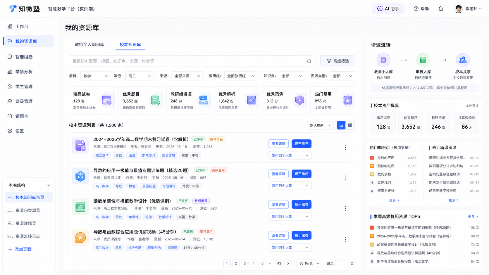

      5. ### 学情分析 教师端

         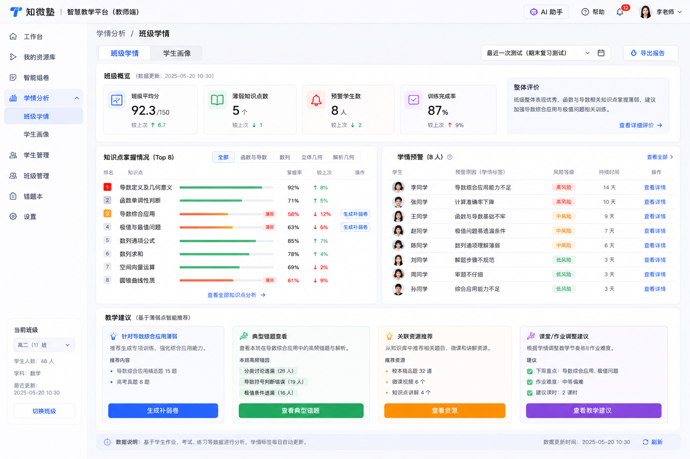

   3. ## 多维知识资产库

      > 将传统题库中的“题目资源”转化为可理解、可计算、可持续更新的教学资产，为AI精准教学提供基础能力。

      > [👋]  
      > 功能差异化：  
      > - **传统题库：**通常仅按照学科、章节简单维度存储题目，无法支撑智能匹配和个性化教学。  
      > - **知微塾：**通过构建题目**多维标签体系**，对题目进行结构化描述，使题目不仅包含“考什么”，还能够表达“考查能力、难度特点、易错方向以及适用场景”。  

      1. ### 题目多维度标签

         - 基础属性：学科，年级，模块

         - 知识维度：知识点、关联知识点

           > 如：高二数学 → 导数 → 极值判断 → 函数单调性

         - 题目属性：难度等级、计算强度

         - 考察能力：计算能力、推理能力、综合应用能力

         - 教学场景：日常训练、单元测试、期中期末复习、专题强化

      2. ### 学生学情标签（动态）

         平台基于学生日常学习过程持续生成和更新个人学情标签，包括：

         - 知识点掌握情况

         - 错因分析：知识点模糊、高频错误、思维误区

         - 能力短板

           例如，平台不会只给出“数学成绩80分”这样的结果，而是能够进一步识别：

         - 导数定义理解不到位

         - 分类讨论能力较弱

         - 计算准确率偏低

         - 综合应用能力不足

           随着学生作答、错题反馈和训练结果变化，这些标签会持续更新，形成动态学情画像。

      3. ### 教师个人知识库

         支持教师将教学过程中产生的优质资源持续沉淀：

         - 收藏公共知识库中的优质题目，上传经典题目

         - 学生典型错题

         - 历史试卷

         - 教学解析

      4. ### 知识资产动态更新

         - **个人学情动态标签：**根据学生多次的作答数据以及自主反馈，得到新的错题归因，更新学生掌握情况。

           > 如，B同学极值问题计算能力弱，当经过多轮相似题训练后，能力增强，只有遇到复杂条件下的极值问题时难以应对，则将该同学标签变更为极值问题灵活性差。

         - 吸收更新的各区域、各校试卷从而使教学资源更加丰富。

           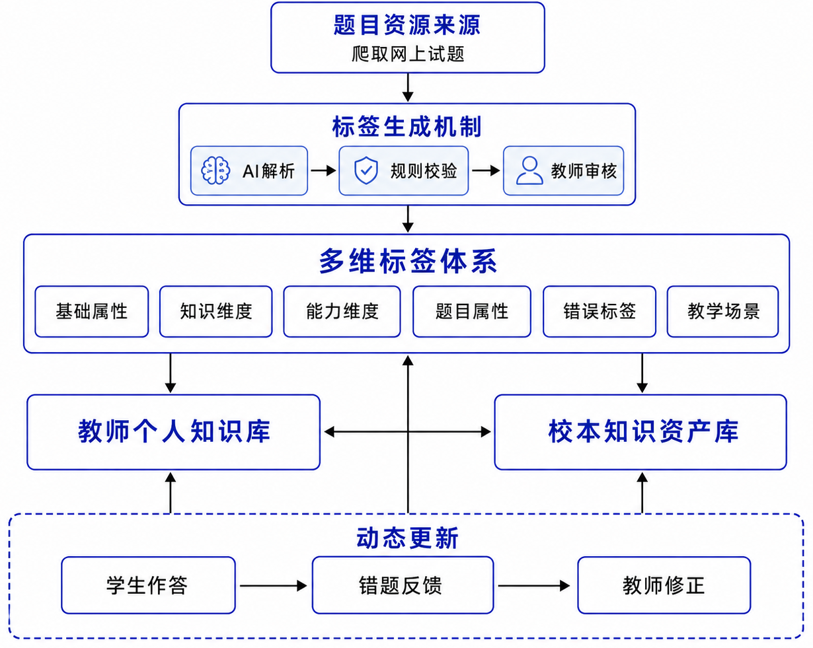

   4. ## 双向标签精准匹配

      > 为合适的学生，在合适的阶段，推荐合适的题目。

      > [💡]  
      > **功能差异化**：  
      > - **传统教育产品：**通常只能基于章节、难度等单一维度推荐题目，缺乏对学生真实能力状态的细粒度刻画，因此容易出现“AI能组卷，但内容不够匹配”的问题。  
      > - **知微塾：**为学生建立动态学情标签，并通过知识图谱打通“题目—知识点—能力要求—学生掌握情况”的关联关系，使平台能够真正理解：  
      >   - 这道题考什么；  
      >   - 这个学生薄弱在哪里；  
      >   - 哪类题最适合当前训练目标。  

      1. ### 题目—学生知识图谱关联

         平台通过知识图谱建立以下关联关系：

         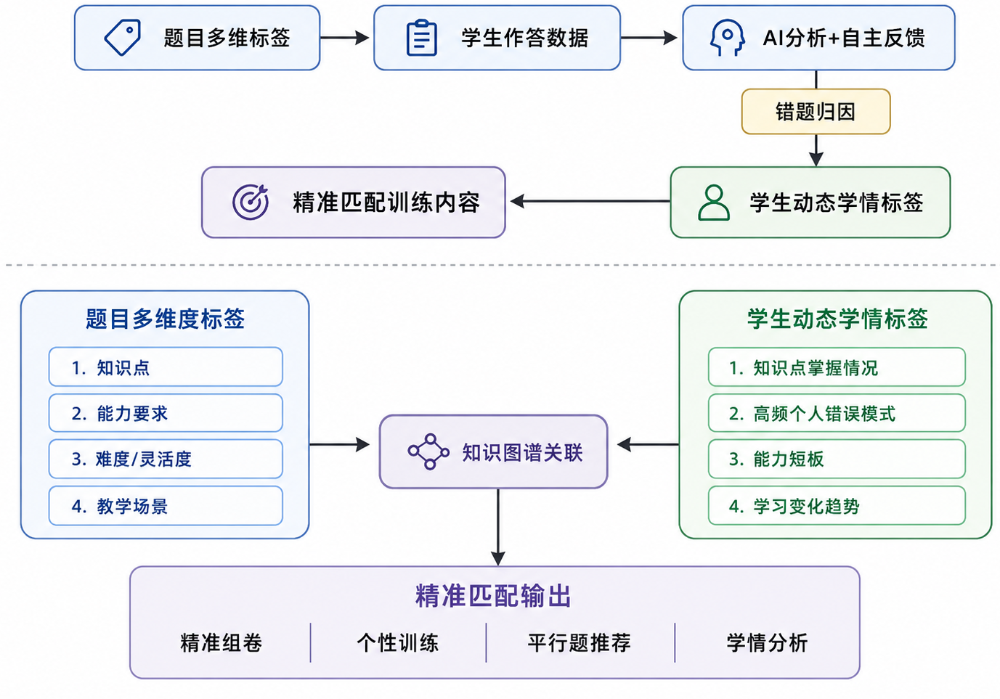

         例如，一道题被识别为：

         |知识点|能力要求|题目属性|
         |---|---|---|
         |导数|计算能力3/5|难度 4/5|
         |极值判断|推理能力 4/5|灵活度 5/5|
         |函数单调性|综合应用 5/5|---|

         同时，学生完成该题后的真实表现被记录：

         - 是否正确

         - 作答过程

         - 错误类型

         - 修改情况

           系统结合题目属性与学生作答结果，逐步形成个人学情标签。

           例如：

           学生多次出现：

         - 导数符号判断错误

         - 极值条件遗漏

           系统更新：

           > 该学生“导数综合应用能力不足”。

           从而，为该同学精准推送对应的练习题。

   5. ## AI Agent驱动的可控式智能组卷

      > 基于多维知识资产库和学生学情标签，为教师提供“可生成、可解释、可修改”的智能组卷能力。

      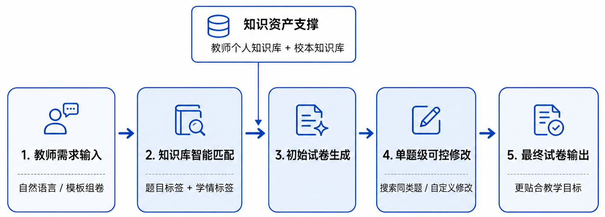

### **（1）自然语言**

教师可以直接描述教学需求，例如：

> “生成一套高二数学期末复习卷，覆盖函数、导数和数列，适当加强导数综合应用，整体中等偏难。”

Agent自动解析：年级，学科，考试场景，知识范围，难度要求，强化方向

再根据题目多维标签从知识库完成匹配。

### **（2）模板组卷**

对于不习惯使用自然语言组卷的教师，可以直接选择对应的标准模板：

|**考试类型**|日常作业|单元测试|期中考试|期末复习|模拟卷|
|---|---|---|---|---|---|
|**组卷参数**|知识点覆盖|题型结构|难度比例|计算强度|灵活度|

系统根据模板约束自动匹配题目。

### （3）基于学情的精准组卷

这一点直接连接**双向标签精准匹配**。比如系统发现高二（1）班：

- 导数综合应用薄弱

- 数列基础较稳定

- 函数单调性存在共性问题

  教师选择：

  > “按本班薄弱点生成复习卷”

  系统实际调用的是：**班级学情标签 × 题目多维标签，**然后提高相应知识点和能力要求题目的覆盖比例。

### **（4） 单题级可控修改** **⭐**

普通AI组卷经常是：

> 生成一整套 → 某题不满意 → 换一道

我们做到教师直接针对**单题**操作：

**搜索同类题**

> 保留知识点、能力要求和难度范围，替换为另一道匹配题。

**自然语言修改**

例如：

> “这道题计算量太大，换一道知识点相同但计算强度2/5以内的。”

> “保持导数综合应用，但降低一点难度。”

> “换成一道更灵活、计算量更小的题。”

系统重新把自然语言转成标签条件：知识点不变 + 难度↓ + 计算强度↓ + 灵活度↑**，**再从知识库寻找候选题。

**自定义修改：**

手动修改或拍照上传想替换的题目。

## 5.平台其余能力

1. ### 学情分析与教学反馈

   通过采集学生学习过程数据以及动态学情标签，为教师和学校提供可视化教学反馈。

   **学生能力画像:**

   - 考试成绩变化图；

   - 各学科能力雷达图；

   - 个人能力薄弱点；

   - 支持查看个人勋章墙、积分榜。

     **班级学情分析:**

   - 统计班级知识点掌握情况，班级学科能力雷达图；

   - 支持班级学情预警；

   - 分析高频错误类型，辅助教师调整教学重点。

     **教研数据支持:**

   - 汇总不同班级、不同阶段学习情况；

   - 支持查看老师分配情况；

   - 支持年级学情预警。

2. ### 家校协同

   连接教师、学生与家长，实现学习过程透明化和持续反馈。

   - 学习任务同步；

   - 作业完成情况查看；

   - 阶段学习与考试成绩报告。

## 6. 功能边界

- 本期产品仅支持高中语数英三科的全链路教育。

- 本期暂不支持题目难度标签的自适应变化。

1. # 技术路线

   1. ## 技术复杂度：

      |**维度**|**等级**|**文档依据**|**主要难点**|
      |---|---|---|---|
      |AI 原生能力|高|Chat+RAG、AI伴学、初评、组卷、错因分析|接地引用≥80%、不泄题式伴学、主观题人机协同批改|
      |知识资产体系|高|校级库 / 个人库、标签、权限、版本、审核入库|双层流转、未审核题不可组卷、资产可复用可进化|
      |认知建模|高|三层记忆、BKT 最小掌握度、弱项出题、错题本|掌握度可解释到 L2/L1 证据；24h 内弱项练习闭环|
      |业务闭环|中高|教-学-练-评-管 / 教-学-练-评-析-改|班级热力→补弱卷≤3分钟；成绩确认回流掌握度|
      |安全与合规|中|A7 权限隔离、家长周报不含完整对话|学生禁调监考/成绩写工具；跨班不可见；隐私边界|
      |交付形态|中高|ToB 年费、私有化 + SaaS|同一产品需兼顾多租户与校内独立部署|

   2. ## 技术架构

      |**层级**|**选型**|**说明**|
      |---|---|---|
      |网页端|&nbsp;TS + React |师生主路径优先；家长/管理可精简|
      |移动端|uni-app 小程序||
      |业务后端|Go + · Gin · GORM |对外唯一 BFF/API|
      |鉴权|JWT + Casbin |角色/班级/工具 ACL|
      |业务库|MySQL |InnoDB；JSON 存扩展字段|
      |缓存/队列|Redis  + asynq|会话、热力缓存、异步批改投递|
      |对象存储|MinIO|课件/试卷/拍照；预签名上传|
      |AI 服务|Python · FastAPI|内网 HTTP；Go 编排调用|
      |向量库|Chroma（演示）→ Qdrant（放量）|与 MySQL 解耦|
      |文档解析|PyMuPDF / unstructured|仅 AI 服务|
      |LLM|OpenAI 兼容（DeepSeek）|经 AI 服务访问|
      |OCR（可选）|PaddleOCR|演示可 Mock/少量样例|

   3. ## 排期

      |**阶段**|**周期建议**|**范围**|**交付物**|
      |---|---|---|---|
      |**M0**|第 1周|登录角色、知识库上传、基础 Chat+RAG 引用、单课手工 KG|可演示接地答疑|
      |**M1**|第 2 周|三层记忆、BKT 最小掌握度、弱项出题、错题本|学—练闭环|
      |**M2**|第 3 周|班级热力、审核题库、简单组卷考试|教师侧完整故事|
      |**M3**|第 4 周|行为风险分、语义查重、SIS 成绩回流、家长周报（可选）|评—管闭环|
      |**M4**|第 5 周|全部功能的可用性测试和BUG修复|产品化测试|

   4. ## 验收标准

      |**编号**|**验收项**|**标准**|
      |---|---|---|
      |A1|接地解题|≥80% 终答步骤含有效引用，且可点击回原文|
      |A2|个性化闭环|辅导识别的弱项概念，24h 内可出现对应练习推荐|
      |A3|教师效率|从打开班级热力到发布补弱卷 ≤ 3 分钟（演示脚本）|
      |A4|题库质量闸门|未审核题目不可进入正式组卷|
      |A5|掌握度可解释|画像/节点主张可展开到 L2/L1 证据|
      |A6|考试回流|教师确认成绩后，成绩册与掌握度均更新成功|
      |A7|权限隔离|学生无法调用监考/成绩写入类工具；跨班数据不可见|
      |A8|部署|部署后可完成上述演示路径|

2. # 典型应用场景

## 场景一：期末复习与考试后的教学闭环

**场景背景：**

高二数学期末复习阶段，教师需要针对一学期多个章节内容设计综合复习卷。考试结束后，教师不仅需要了解整体成绩情况，更需要快速定位班级共性问题和学生个体薄弱知识点，并据此调整后续复习策略。

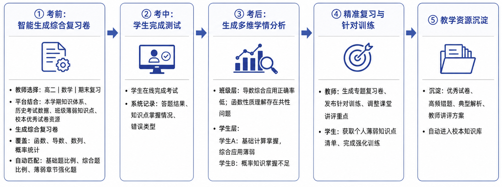

## 场景二：新教师备课与校本资源复用闭环

通过连接学校知识库和教师个人知识库，让新教师能够快速调用校本优秀资源，同时将自身教学过程中的优质内容持续沉淀，实现“经验传承—教学实践—资源积累”的闭环。

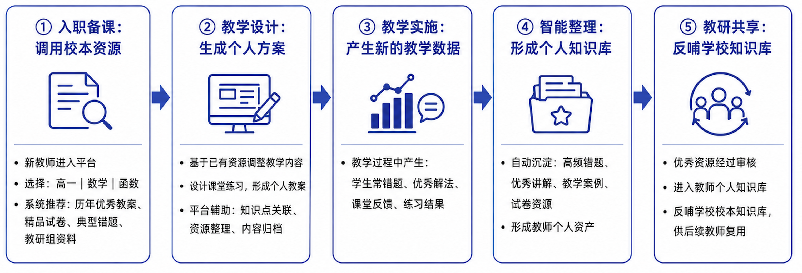

## 场景三：学生成长追踪与家校协同闭环

通过连接学生学习数据、教师教学反馈和阶段性评价结果，形成学生成长画像，帮助教师与家长共同关注学生学习过程，实现从“关注成绩结果”到“关注成长过程”的转变。

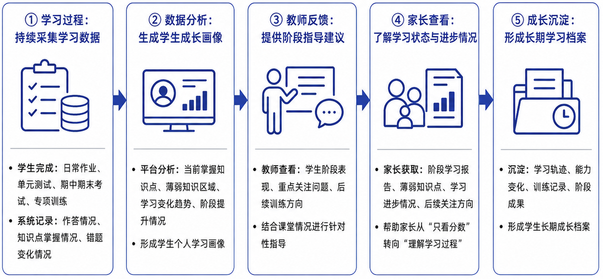

1. # 产品愿景

   1. ## 商业价值

      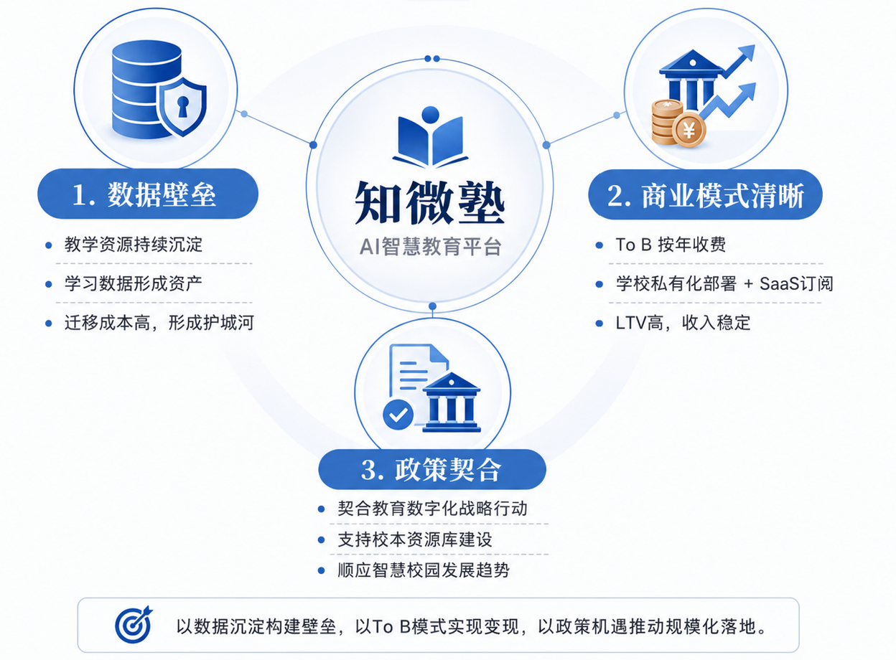

## 2.产品发展规划

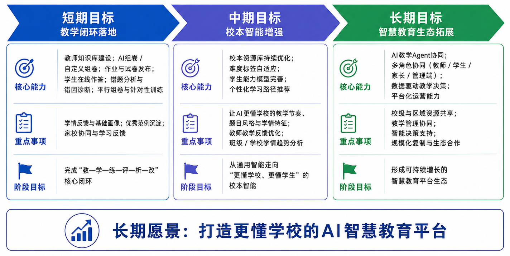
